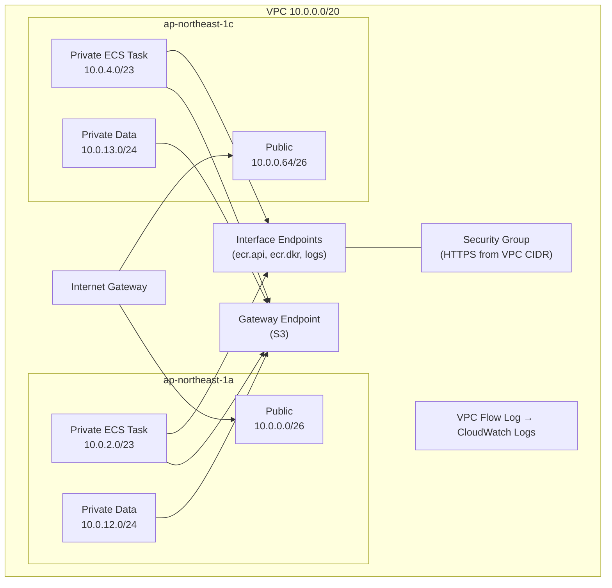

# Design: vpc-network

## アーキテクチャ概要

ECS Fargate ワークロード向けの VPC ネットワーク基盤。NAT Gateway を使わず VPC エンドポイント経由で AWS サービスにアクセスするコスト効率の良い構成。



## コンポーネント

| コンポーネント | Terraform リソース | 説明 |
|---------------|-------------------|------|
| VPC | `aws_vpc` | 10.0.0.0/20、DNS サポート・ホスト名有効 |
| Internet Gateway | `aws_internet_gateway` | パブリックサブネット用 |
| パブリックサブネット | `aws_subnet` (for_each) | /26 × 2 AZ |
| ECS タスク用サブネット | `aws_subnet` (for_each) | /23 × 2 AZ |
| データ用サブネット | `aws_subnet` (for_each) | /24 × 2 AZ |
| ルートテーブル (public) | `aws_route_table` + `aws_route` | IGW へのルート |
| ルートテーブル (private-ecs-task) | `aws_route_table` | ローカルのみ |
| ルートテーブル (private-data) | `aws_route_table` | ローカルのみ |
| ルートテーブル関連付け | `aws_route_table_association` (for_each) | サブネットとルートテーブルの紐付け |
| セキュリティグループ | `aws_security_group` | VPC エンドポイント用（インラインルールなし） |
| Ingress ルール | `aws_vpc_security_group_ingress_rule` | VPC CIDR → 443/tcp |
| Interface エンドポイント | `aws_vpc_endpoint` × 3 | ecr.api, ecr.dkr, logs |
| Gateway エンドポイント | `aws_vpc_endpoint` × 1 | S3 |
| CloudWatch Logs グループ | `aws_cloudwatch_log_group` | フローログ出力先（保持7日） |
| IAM ロール | `aws_iam_role` | フローログ書き込み用 |
| IAM ポリシー | `aws_iam_role_policy` | 最小権限 |
| VPC フローログ | `aws_flow_log` | ALL トラフィック記録 |

## Terraform リソース構成（ファイル分割）

```
step1-vpc-network/terraform/
├── versions.tf      # terraform ブロック, required_providers, provider, default_tags
├── variables.tf     # 入力変数
├── main.tf          # VPC, IGW, サブネット, ルートテーブル, ルート, アソシエーション
├── endpoints.tf     # VPC エンドポイント, セキュリティグループ, ingress ルール
├── flow_log.tf      # フローログ, ロググループ, IAM ロール, IAM ポリシー
└── outputs.tf       # 出力値
```

## 設計決定の記録

### D1: VPC モジュール vs 個別リソース → [ADR-001](../../../docs/adr/001-use-individual-resources-instead-of-vpc-module.md)

| | 採用案 | 代替案 |
|---|--------|--------|
| **案** | 個別リソース（aws_vpc, aws_subnet 等） | terraform-aws-modules/vpc/aws モジュール |
| **決定** | ✅ 採用 | ❌ 却下 |

**却下理由:** ワークショップの学習目的を優先。個別リソースで書くことで各コンポーネントの関係性（VPC→サブネット→ルートテーブル）を理解できる。モジュールは抽象化が進みすぎて初学者には中身がブラックボックスになる。

**帰結:** コード量は増えるが、受講者が「何が作られるか」を逐一把握できる。実務でモジュール利用に移行する際の基礎知識となる。

---

### D2: VPC エンドポイント用セキュリティグループの共有方針 → [ADR-002](../../../docs/adr/002-share-single-security-group-for-vpc-endpoints.md)

| | 採用案 | 代替案 |
|---|--------|--------|
| **案** | 3 Interface エンドポイントで 1 SG を共有 | エンドポイントごとに個別 SG |
| **決定** | ✅ 採用 | ❌ 却下 |

**却下理由:** 3つすべてが同一ルール（VPC CIDR → 443/tcp）であり、分離の実益がない。YAGNI 原則に従い、将来必要時に分離する。

**帰結:** エンドポイント追加時に異なるルールが必要になった場合、SG を分離する ADR を起票して対応する。

---

### D3: VPC フローログ IAM ロールの設計 → [ADR-003](../../../docs/adr/003-dedicated-iam-role-for-flow-logs.md)

| | 採用案 | 代替案 |
|---|--------|--------|
| **案** | フローログ専用ロール（最小権限） | 汎用ログ書き込みロール |
| **決定** | ✅ 採用 | ❌ 却下 |

**却下理由:** steering の terraform-standards.md が最小権限を要求。汎用ロールはリソース ARN が広くなり、意図しないロググループへの書き込みが可能になるリスクがある。

**構成:**
- Trust policy: `vpc-flow-logs.amazonaws.com` のみ
- Permissions: `logs:CreateLogGroup`, `logs:CreateLogStream`, `logs:PutLogEvents`, `logs:DescribeLogGroups`, `logs:DescribeLogStreams`
- Resource: 当該ロググループ ARN に限定

**帰結:** フローログ以外の用途には別途ロールを作成する必要がある（これは意図した制約）。

---

### D4: ファイル分割方針 → [ADR-004](../../../docs/adr/004-split-terraform-files-by-concern.md)

| | 採用案 | 代替案 |
|---|--------|--------|
| **案** | main.tf / endpoints.tf / flow_log.tf に3分割 | 全リソースを main.tf に集約 |
| **決定** | ✅ 採用 | ❌ 却下 |

**却下理由:** 合計約28リソースで steering の structure.md が定める15リソース上限を超過。1ファイルでは可読性が低下する。

**帰結:** 用途別にファイルを分けることで、変更影響範囲が明確になる。

---

### D5: プライベートルートテーブルの分離 → [ADR-005](../../../docs/adr/005-separate-route-tables-per-private-subnet-type.md)

| | 採用案 | 代替案 |
|---|--------|--------|
| **案** | private-ecs-task 用と private-data 用で2つ | 全プライベートサブネットで1つ共有 |
| **決定** | ✅ 採用 | ❌ 却下 |

**却下理由:** 後続 Step で ECS タスク用サブネットにだけルートを追加する可能性がある（追加 VPC エンドポイント等）。ルートテーブルは無料なのでコスト影響なし。

**帰結:** S3 Gateway エンドポイントは両方のルートテーブルに関連付ける必要がある。

---

### D6: サブネット定義方法 → [ADR-006](../../../docs/adr/006-use-for-each-for-subnet-definitions.md)

| | 採用案 | 代替案 |
|---|--------|--------|
| **案** | `for_each` で動的生成 | 個別にハードコード定義 |
| **決定** | ✅ 採用 | ❌ 却下 |

**却下理由:** steering の terraform-best-practices.md が `for_each` を推奨。AZ は2つ固定で map 構造が単純なため学習コストも低い。DRY 原則に合致。

**帰結:** `for_each` の key 変更（AZ 追加/削除）時は state の移動が必要になる可能性がある。

---

### D7: セキュリティグループルールの定義方法 → [ADR-007](../../../docs/adr/007-use-standalone-security-group-rules.md)

| | 採用案 | 代替案 |
|---|--------|--------|
| **案** | `aws_vpc_security_group_ingress_rule`（スタンドアロン） | `aws_security_group` のインラインルール |
| **決定** | ✅ 採用 | ❌ 却下 |

**却下理由:** プロバイダ公式ドキュメント（v6.56.0）でスタンドアロンルールが「current best practice」と明記。インラインルールは複数 CIDR やタグ管理に問題があるため非推奨。

**帰結:** `aws_security_group` リソースでは `ingress`/`egress` ブロックを使わず、ルールは別リソースで管理する。

## Outputs

| output 名 | 値 | 用途 |
|-----------|-----|------|
| `vpc_id` | VPC の ID | 後続リソースの VPC 指定 |
| `vpc_cidr_block` | VPC の CIDR | 他 SG ルールでの参照 |
| `public_subnet_ids` | パブリックサブネットの ID リスト | ALB 配置 |
| `private_ecs_task_subnet_ids` | ECS タスク用サブネットの ID リスト | ECS サービス配置 |
| `private_data_subnet_ids` | データ用サブネットの ID リスト | RDS 等の配置 |
| `vpc_endpoint_sg_id` | エンドポイント用 SG の ID | 参照・デバッグ用 |

## 技術的制約

- AWS プロバイダ: hashicorp/aws ~> 6.21（最新は 6.56.0、互換性あり）
- リージョン: ap-northeast-1 固定
- NAT Gateway 不使用（コスト制約）
- VPC エンドポイントの Interface 型は AZ あたり $0.014/h のコストが発生
